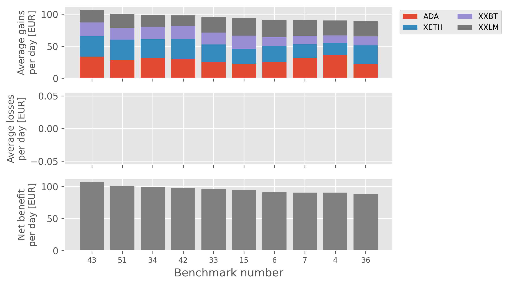
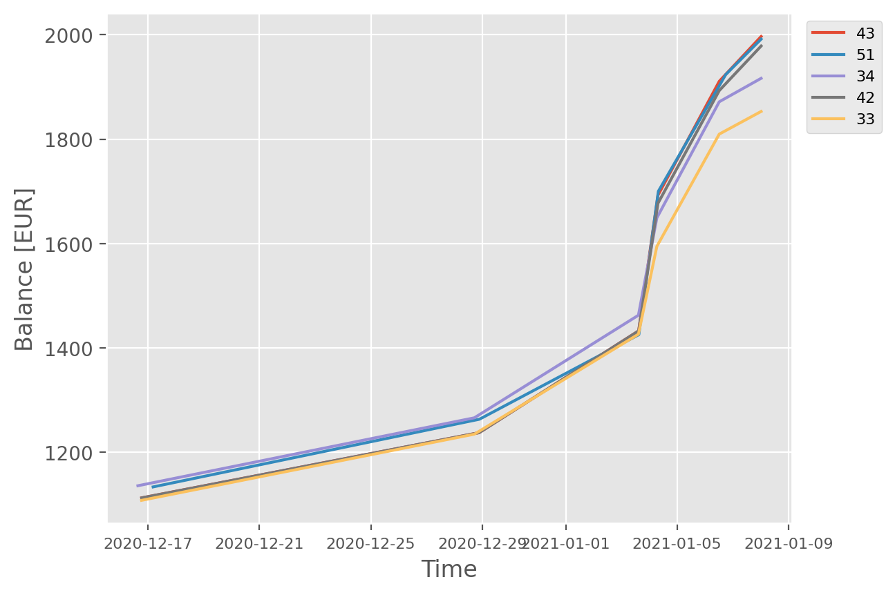

# Instructions to train a Python trading bot with Kraken

## Aim of the project
This project presents how the Kraken trading bot I [previously developed](https://github.com/SchniderB/kraken-trading-bot)
was trained and how the optimal set of parameters was selected.


## Disclaimer
This is an educational project, not a real investment strategy or advice, and I take no responsibility for any financial
losses or misuse of this code.


## Dependencies
### Requirements
- Python 3.6 or Higher
- Kraken's Python API client `krakenex` (set-up described below)
- Script `algorithm.py`
- Script `evaluate_algorithm.py`
- The cryptocurrency price history data stored in a parent folder


### First set-up
1. Install `virtualenv` if it is not already installed
```bash
pip install virtualenv
```
2. Create virtual environment in your folder of interest
```bash
virtualenv krakenex
```
3. Activate the virtual environment
```bash
source krakenex/bin/activate
```
4. Install the required libraries in the virtual environment using the `requirements.txt` file
```bash
pip install -r requirements.txt
```

### Reactivate the virtual environment each time you need to use the trading bot
```bash
source krakenex/bin/activate
```


## General project structure
### Input data
The cryptocurrency price history data used to simulate trading was stored in the parent folder and was made of the complete 
trade history available on Kraken. Please refer to my [crypto history extraction](https://github.com/SchniderB/crypto-history-extraction) 
project if you want to extract the history data on your own.

### Script organization
#### Algorithm benchmarking script
The scripts `algorithm4.py` and `algorithm5.py` were provided as examples of training codes, but in practice, several other 
scripts were used with different time frames and parameter sets, to test several different algorithms and algorithm versions, 
as detailed in `Code_Specifications.txt`. The present instructions will only detail the use of the script `algorithm5.py`.

#### Utility package
The modules `utilities.py` and `query_public_info.py` from the package `tradingbot` are used by the scripts `algorithm4.py` 
and `algorithm5.py` to provide different utility functions.

#### Benchmark result evaluation script
The script `evaluate_algorithm.py` processes the output files of the algorithm benchmark and selects the optimal set of 
parameters for profit generation.

### Output data
- `pipeline_parameters.txt`: File that contains the different parameter combinations for the algorithm benchmark. Generated by `algorithm5.py`
- `$CRYPTO_records.txt`: File that contains the algorithm trading decision history for the cryptocurrency `$CRYPTO`. Generated by `algorithm5.py`
- `algorithm5_ranked_results.txt`: File that contains the algorithm profit results for each parameter combination. Generated by `evaluate_algorithm.py`
- `algorithm5_benefit.png`: Graph that shows the average gains / losses / net benefit per day for the top 10 parameter sets.
Generated by `evaluate_algorithm.py`
- `algorithm5_total.png`: Graph that shows the total gains / losses / net benefit for the top 10 parameter sets. Generated by `evaluate_algorithm.py`
- `$CRYPTO_balance_evolution.png`: Evolution of the base currency balance over time based on the trading results for the cryptocurrency `$CRYPTO`. 
Generated by `evaluate_algorithm.py`


## Settings and requirements
### Fiat base currency selection
You will need to specify the fiat base currency as the value of the variable `base_currency` in the script `algorithm5.py` 
which is set to `ZEUR` by default which stands for the Euro.

### List of cryptocurrencies
You can define the list of cryptocurrencies you want the trading bot to speculate on with the variable `currencies` in the 
script `algorithm5.py`. The pairs should also be specified with the variable `all_pairs`.

### Minimal balance
The available base currency balance per cryptocurrency is defined by the variable `funds`.

### Algorithm parameters
The following parameters were assigned various values, and all combinations of these values were tested by simulating trades:
- `drop_rate`: Price drop percentage value over a `drop_time_frame` that will trigger a buy order
- `drop_time_frame`: History time frame on which the price drop is assessed, e.g. a `drop_rate` of 2% will trigger the buy 
condition only if the price dropped by at least 2% on this specified period of time
- `end_tendency`: A price dropping tendency will be considered over after the price raised of this specific percentage. 
E.g. if the price drops for a while and then increases of 2%, the dropping tendency will be considered as finished. The 
buy condition will be triggered only after the dropping tendency finishes
- `min_benef`: The trading bot will only sell a cryptocurrency if it made at least this percentage of benefit
- `history_regression`: History time frame on which the price trend and direction is assessed


## Launch the cryptocurrency trading bot with all the parameter combinations on the cryptocurrency price history
A simple Python command will launch the benchmark:
```bash
python3 algorithm5.py  # To test the algorithm 5
```
The benchmark script tests several parameter combinations over a large history. Therefore, I recommend running it in a 
detached terminal state. You can use the terminal multiplexer `Screen` for this purpose.


## Generate metrics and plots to rank the different sets of parameters
The following command uses the output of the previous benchmark to generate graphs and statistics, thereby enabling to 
select the most optimal parameter values for the selected algorithm:
```bash
python3 evaluate_algorithm.py
```


## Results
### Algorithm selection
The overall best strategy is to select the algorithm with the highest total net benefit per day. In the case of this project, 
the algorithm was developed during a bull run, and trained on a short bull run period in order to optimize the short term 
profits. The algorithm is therefore designed to run only during a bull run period, as it focuses on high fluctuations. If 
you want more details regarding my algorithm development history and strategy, you can examine the file `Code_Specifications.txt`.

### Parameter selection
Based on the graph `algorithm5_benefit.png` the most optimal parameter sets can be selected:


Based on the graphs per crypto, as shown in the below example, algorithms that tend to trade more regularly can be selected:

The purpose of selecting an algorithm that trades more regularly is to adapt the strategy to the short duration of a bull run.


## Project Timeline
- Start Date: September 2020
- Completion Date: December 2020
- Maintenance status: Inactive
